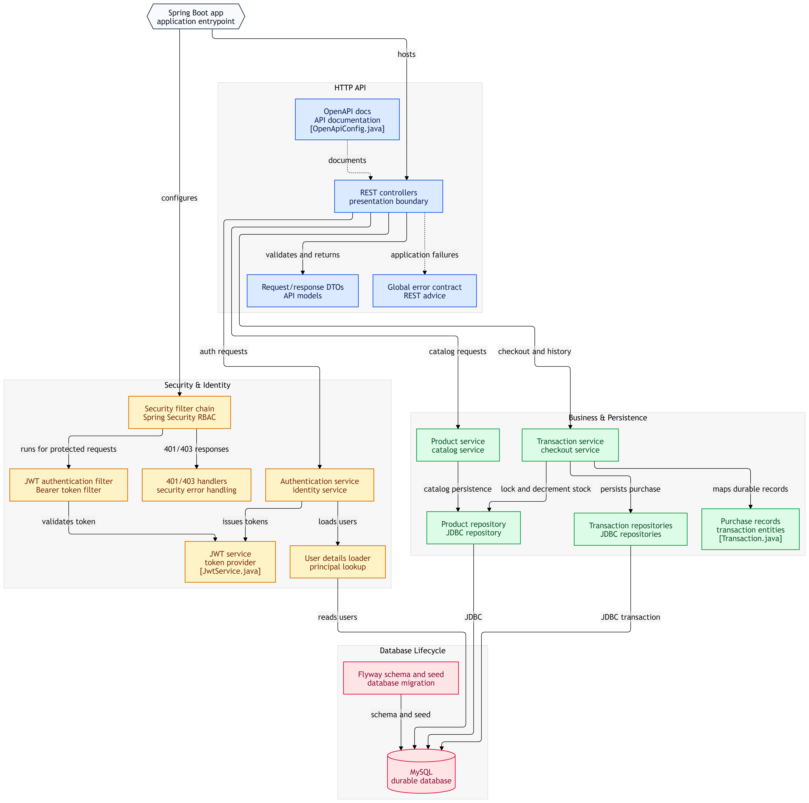
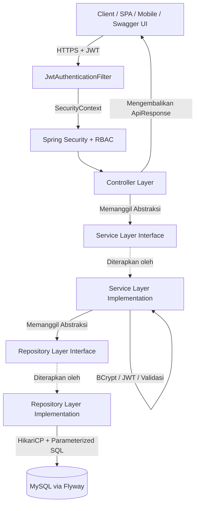

<div align="center">

# 🏪 RetailFlow

**Enterprise-Grade RESTful API for Online Store & Point of Sales — Java 25, Spring Boot 3, Clean Architecture, RBAC + JWT**

[](https://www.oracle.com/java/)
[](https://spring.io/projects/spring-boot)
[](https://maven.apache.org/)
[](https://www.mysql.com/)
[](https://spring.io/projects/spring-security)
[](https://flywaydb.org/)
[](https://github.com/brettwooldridge/HikariCP)
[](https://springdoc.org/)
[](#-testing)
[](#-arsitektur-sistem)

</div>

---

## 📖 Ringkasan Proyek (Overview)

**RetailFlow** adalah RESTful API untuk aplikasi **Point of Sales (POS) & e-commerce** yang dirancang dengan standar arsitektur enterprise modern: **Clean Architecture, SOLID Principles, Spring Boot 3, Spring Security dengan JWT, dan RBAC (Role-Based Access Control)**.

Sistem menyediakan endpoint untuk registrasi & login (JWT), katalog produk, transaksi pembelian, serta kontrol akses berbasis peran (**USER** & **ADMIN**). Dokumentasi API tersedia secara interaktif melalui **Swagger UI** (OpenAPI 3).

Arsitektur berlapis dengan **Interface Abstraction** memisahkan Presentation (Controller), Business Logic (Service), dan Data Access (Repository) — sehingga _testable_, _maintainable_, dan siap _scale_ secara horizontal.

---

## 🏛️ Arsitektur Sistem (Clean Architecture)



### 🧩 Keterangan Diagram Alur Komponen Arsitektur

Diagram di atas menggambarkan alur dan interaksi antar komponen dalam sistem RetailFlow dari entrypoint aplikasi hingga penyimpanan data:

1. **Spring Boot Entrypoint**
   - Menginisialisasi seluruh konfigurasi aplikasi, HTTP API, dan rantai keamanan Spring Security.

2. **HTTP API (Presentation Layer)**
   - **REST Controllers**: Boundary utama yang menangani request/response HTTP.
   - **OpenAPI Docs**: Integrasi Swagger UI (`OpenApiConfig.java`) untuk dokumentasi API interaktif.
   - **Request/Response DTOs**: Model validasi input dan pengembalian data terstandarisasi via `ApiResponse<T>`.
   - **Global Error Contract**: Penanganan exception global (`GlobalExceptionHandler`) untuk error response JSON konsisten.

3. **Security & Identity (Keamanan & Autentikasi)**
   - **Security Filter Chain & RBAC**: Menjaga endpoint terlindungi berdasarkan role pengguna (`USER` / `ADMIN`).
   - **JWT Authentication Filter**: Memeriksa dan memverifikasi Authorization Bearer Token pada setiap protected request.
   - **Authentication Service & JWT Service (`TokenProvider`)**: Menangani penerbitan, validasi token, serta enkripsi password.
   - **User Details Loader & Error Handlers**: Mengambil data principal pengguna dan menangani skenario Unauthorized (401) / Forbidden (403).

4. **Business & Persistence (Logika Bisnis & Akses Data)**
   - **Product Service & Repository**: Pengelolaan katalog produk, pembaruan stok, dan query JDBC.
   - **Transaction Service & Repository**: Eksekusi checkout atomik, penguncian stok (*pessimistic locking*), pembuatan record `Transaction` dan `TransactionDetail`.

5. **Database Lifecycle (Basis Data & Migrasi)**
   - **Flyway Schema & Seed Migration**: Otomasi eksekusi DDL schema (`V1__create_schema.sql`) dan seeding data awal (`R__init_data.sql`).
   - **MySQL Durable Database**: Media penyimpanan relational utama berbasis MySQL 8.0+.



### 🌟 Key Engineering Highlights

1. **Spring Security 6 + JWT (jjwt 0.12)**
   - Stateless `SecurityFilterChain` dengan custom `JwtAuthenticationFilter` (Once-per-Request).
   - HS256 signed JWT; **access token (1 jam)** + **refresh token (7 hari)** dengan `jti`, `iss`, `exp`, `sub` dan custom claims (`username`, `email`, `role`).
   - BCrypt `PasswordEncoder` (strength 12) untuk hashing password.
2. **Role-Based Access Control (RBAC)**
   - **USER** → read katalog publik, buat transaksi.
   - **ADMIN** → CRUD produk, lihat seluruh transaksi, listing user.
   - Enforcement di URL level (`SecurityFilterChain`) **+** method level (`@PreAuthorize`).
3. **Clean Architecture & DIP/ISP**
   - Controller → Service interface → Service impl → Repository interface → Repository impl.
   - Domain entity terpisah dari DTO request/response (tidak bocor ke API).
4. **Transaksi DB Atomik (ACID)**
   - Checkout menggunakan `setAutoCommit(false) / commit() / rollback()` di layer service — anti race condition.
5. **HikariCP Connection Pooling**
   - `try-with-resources` + `DataSourceUtils` — anti connection leak.
6. **Flyway Migration**
   - `V1__create_schema.sql` (versioned) + `R__init_data.sql` (repeatable seed).
7. **OpenAPI 3 / Swagger UI**
   - springdoc-openapi 2.6 — interaktif di `/swagger-ui.html`, JSON di `/api/docs`.
8. **Global Exception Handler**
   - `MethodArgumentNotValidException`, custom `AppException` family, Spring Security `AccessDenied` & `AuthenticationException` — semua response JSON konsisten lewat `ApiResponse<T>`.
9. **DTO Pattern + Validation**
   - Jakarta Bean Validation (`@NotBlank`, `@Email`, `@Size`) di request DTO, dan trim/sanitasi di service.
10. **TokenProvider Abstraction (DIP)**
    - `JwtService` di-extract ke interface `TokenProvider` — `AuthServiceImpl` & `JwtAuthenticationFilter` depend pada abstraksi, sehingga 100% mockable di unit test (tanpa Bytecode enhancement) dan siap di-swap ke JWT provider lain (RS256, Keycloak) tanpa ubah business logic.

---

## 🔐 Model Keamanan (Security Model)

| Aspek            | Implementasi                                                              |
| :--------------- | :------------------------------------------------------------------------ |
| Autentikasi      | JWT (HS256) — `Authorization: Bearer <token>`                             |
| Password Storage | BCrypt (strength 12)                                                      |
| Session          | Stateless (tidak ada HttpSession)                                         |
| CSRF             | Disabled (karena stateless + JWT)                                         |
| Authorization    | URL-based (`SecurityFilterChain`) + method-based (`@PreAuthorize`)        |
| Token Claims     | `sub=userId`, `iss=app`, `jti`, `iat`, `exp`, `role`, `username`, `email` |
| Refresh Token    | Stateless; rotation via `POST /api/v1/auth/refresh`                       |
| Error Response   | JSON `ApiResponse{success, message, data}` — 401/403 terstandarisasi      |

**Role Matrix:**

| Endpoint                                    | USER | ADMIN | Public |
| :------------------------------------------ | :--: | :---: | :----: |
| `POST /api/v1/auth/register`                |  —   |   —   |   ✅   |
| `POST /api/v1/auth/login`                   |  —   |   —   |   ✅   |
| `POST /api/v1/auth/refresh`                 |  ✅  |  ✅   |   —    |
| `GET /api/v1/products/**`                   |  ✅  |  ✅   |   ✅   |
| `POST/PUT/PATCH/DELETE /api/v1/products/**` |  ❌  |  ✅   |   ❌   |
| `POST /api/v1/transactions`                 |  ✅  |  ✅   |   ❌   |
| `GET /api/v1/transactions`, `/details`      |  ❌  |  ✅   |   ❌   |
| `GET /api/v1/users/me`                      |  ✅  |  ✅   |   ❌   |
| `GET /api/v1/users`                         |  ❌  |  ✅   |   ❌   |

---

## 📁 Struktur Proyek (Directory Structure)

```text
src/main/
├── java/toko_online/
│   ├── TokoOnlineApplication.java            # Spring Boot entry point
│   │
│   ├── config/
│   │   └── OpenApiConfig.java                 # OpenAPI 3 / Swagger UI
│   │
│   ├── controller/                            # HTTP Layer (REST Endpoints)
│   │   ├── AuthController.java                # /api/v1/auth/{register,login,refresh}
│   │   ├── ProductController.java             # /api/v1/products
│   │   ├── TransactionController.java         # /api/v1/transactions
│   │   └── UserController.java                # /api/v1/users/{me,}
│   │
│   ├── security/                              # Spring Security + JWT
│   │   ├── SecurityConfig.java                # SecurityFilterChain + RBAC rules
│   │   ├── JwtService.java                    # Generate / parse / validate JWT
│   │   ├── JwtAuthenticationFilter.java       # OncePerRequestFilter
│   │   ├── AppUserDetailsService.java         # UserDetailsService adapter
│   │   ├── AppUserPrincipal.java              # UserDetails implementation
│   │   ├── SecurityErrorHandlers.java         # 401/403 JSON entry points
│   │   └── CurrentUser.java                   # SecurityContext helper
│   │
│   ├── service/                               # Business Logic (Interface Abstraction)
│   │   ├── AuthService.java
│   │   ├── ProductService.java
│   │   ├── TransactionService.java
│   │   └── impl/
│   │       ├── AuthServiceImpl.java
│   │       ├── ProductServiceImpl.java
│   │       └── TransactionServiceImpl.java
│   │
│   ├── repository/                            # Data Access Layer
│   │   ├── UserRepository.java
│   │   ├── ProductRepository.java
│   │   ├── TransactionRepository.java
│   │   ├── TransactionDetailRepository.java
│   │   └── impl/
│   │       ├── UserRepositoryImpl.java
│   │       ├── ProductRepositoryImpl.java
│   │       ├── TransactionRepositoryImpl.java
│   │       └── TransactionDetailRepositoryImpl.java
│   │
│   ├── model/
│   │   ├── entity/                            # Domain Entities
│   │   │   ├── User.java
│   │   │   ├── Product.java
│   │   │   ├── Transaction.java
│   │   │   └── TransactionDetail.java
│   │   ├── dto/
│   │   │   ├── request/                       # Request DTOs (Jakarta Validation)
│   │   │   │   ├── LoginRequest.java
│   │   │   │   ├── RegisterRequest.java
│   │   │   │   ├── ProductRequest.java
│   │   │   │   ├── UpdateProductRequest.java
│   │   │   │   └── TransactionRequest.java
│   │   │   └── response/                      # Response DTOs
│   │   │       ├── ApiResponse.java           # Generic wrapper
│   │   │       ├── LoginResponse.java         # + accessToken/refreshToken
│   │   │       ├── UserResponse.java
│   │   │       ├── ProductResponse.java
│   │   │       ├── TransactionResponse.java
│   │   │       └── TransactionDetailResponse.java
│   │   └── enums/
│   │       ├── Role.java                      # USER, ADMIN
│   │       ├── TransactionStatus.java
│   │       └── PaymentMethod.java
│   │
│   └── exception/                             # Custom Exception Hierarchy
│       ├── AppException.java
│       ├── DatabaseException.java
│       ├── InsufficientStockException.java
│       ├── ResourceNotFoundException.java
│       ├── UnauthorizedException.java
│       ├── ValidationException.java
│       └── GlobalExceptionHandler.java        # @RestControllerAdvice
│
└── resources/
    ├── application.properties                 # Spring config (DB, JWT, HikariCP, Springdoc)
    ├── logback.xml
    └── db/
        ├── migration/
        │   └── V1__create_schema.sql
        └── seed/
            └── R__init_data.sql
```

---

## 🗄️ Skema Basis Data (Database Schema)

```sql
CREATE DATABASE IF NOT EXISTS `java_toko_online`
  CHARACTER SET utf8mb4 COLLATE utf8mb4_unicode_ci;
USE `java_toko_online`;

CREATE TABLE `user` (
    `id` BIGINT AUTO_INCREMENT PRIMARY KEY,
    `username` VARCHAR(50) NOT NULL UNIQUE,
    `password` VARCHAR(255) NOT NULL,
    `email` VARCHAR(100) NOT NULL UNIQUE,
    `role` VARCHAR(20) DEFAULT 'user',
    `phone_number` VARCHAR(20),
    `address` TEXT,
    `pos_code` VARCHAR(10),
    INDEX `idx_user_email` (`email`),
    INDEX `idx_user_username` (`username`)
) ENGINE=InnoDB DEFAULT CHARSET=utf8mb4;

CREATE TABLE `product` (
    `id` INT AUTO_INCREMENT PRIMARY KEY,
    `name` VARCHAR(100) NOT NULL,
    `price` DOUBLE NOT NULL,
    `stock` INT NOT NULL DEFAULT 0,
    INDEX `idx_product_name` (`name`)
) ENGINE=InnoDB DEFAULT CHARSET=utf8mb4;

CREATE TABLE `transactions` (
    `id_transaction` VARCHAR(64) PRIMARY KEY,
    `user_email` VARCHAR(100) NOT NULL,
    `total_price_amount` INT NOT NULL,
    `status` BOOLEAN DEFAULT TRUE,
    `date` DATE NOT NULL,
    `payment_method` VARCHAR(50) NOT NULL,
    INDEX `idx_tx_user_email` (`user_email`),
    INDEX `idx_tx_date` (`date`)
) ENGINE=InnoDB DEFAULT CHARSET=utf8mb4;

CREATE TABLE `transactions_details` (
    `id` INT AUTO_INCREMENT PRIMARY KEY,
    `transaction_id` VARCHAR(64) NOT NULL,
    `product_id` INT NOT NULL,
    `total_price_product` INT NOT NULL,
    `quantity` INT NOT NULL,
    CONSTRAINT `fk_tx_details_transaction`
        FOREIGN KEY (`transaction_id`) REFERENCES `transactions`(`id_transaction`)
        ON DELETE CASCADE ON UPDATE CASCADE,
    CONSTRAINT `fk_tx_details_product`
        FOREIGN KEY (`product_id`) REFERENCES `product`(`id`)
        ON DELETE RESTRICT ON UPDATE CASCADE,
    INDEX `idx_tx_details_tx_id` (`transaction_id`)
) ENGINE=InnoDB DEFAULT CHARSET=utf8mb4;
```

---

## 🛠️ Teknologi & Library

| Komponen            | Teknologi / Library                 | Versi                 | Deskripsi                          |
| :------------------ | :---------------------------------- | :-------------------- | :--------------------------------- |
| **Language**        | Java JDK                            | 17 LTS                | Bahasa pemrograman inti            |
| **Framework**       | Spring Boot                         | 3.3.2                 | Web, Validation, JDBC, Security    |
| **Build Tool**      | Apache Maven                        | 3.x                   | Dependency & build lifecycle       |
| **Database**        | MySQL                               | 8.0+                  | RDBMS                              |
| **Migration**       | Flyway (core + mysql)               | bundled               | Versioned SQL schema               |
| **Connection Pool** | HikariCP                            | bundled (Spring Boot) | High-perf JDBC pool                |
| **Driver JDBC**     | MySQL Connector/J                   | 8.x                   | JDBC driver                        |
| **Security**        | Spring Security                     | 6.x                   | Auth & RBAC                        |
| **JWT**             | jjwt (api, impl, jackson)           | 0.12.6                | HS256 token generation             |
| **Password**        | BCrypt (Favre-lib)                  | 0.10.2                | Adaptive password hashing          |
| **OpenAPI**         | springdoc-openapi-starter-webmvc-ui | 2.6.0                 | Swagger UI / OpenAPI 3             |
| **JSON**            | Jackson                             | bundled               | Serialization DTO ↔ JSON           |
| **Logging**         | SLF4J + Logback                     | bundled               | Structured logging                 |
| **Testing**         | JUnit 5 + Mockito + AssertJ         | bundled               | Unit + slice framework             |
| **Testing Slice**   | Spring Boot Test + MockMvc          | bundled               | `@WebMvcTest`, `@JdbcTest`         |
| **Testing E2E**     | Testcontainers MySQL                | 1.20.x                | Real DB untuk `*IT` (perlu Docker) |
| **Security Test**   | spring-security-test                | bundled               | `@WithMockUser` helper             |
| **Coverage**        | JaCoCo                              | bundled               | `target/site/jacoco/index.html`    |

---

## 🚀 Panduan Menjalankan (Getting Started)

### 1. Prasyarat

- [JDK 25](https://adoptium.net/) (tested with Byte Buddy compatibility flag)
- [MySQL 8+](https://dev.mysql.com/downloads/) (atau XAMPP/MariaDB) untuk runtime
- [Maven 3.9](https://maven.apache.org/)
- [Docker](https://www.docker.com/) (opsional — hanya untuk E2E & concurrency test)

### 2. Konfigurasi Database

Pastikan MySQL berjalan dan buat database (opsional — Flyway akan membuat otomatis):

```sql
CREATE DATABASE IF NOT EXISTS java_toko_online
  CHARACTER SET utf8mb4 COLLATE utf8mb4_unicode_ci;
```

Edit `src/main/resources/application.properties` jika credential berbeda:

```properties
spring.datasource.url=jdbc:mysql://localhost:3306/java_toko_online?useSSL=false&allowPublicKeyRetrieval=true&serverTimezone=UTC
spring.datasource.username=root
spring.datasource.password=
```

### 3. Konfigurasi JWT (Production)

Ganti `app.jwt.secret` dengan base64 string minimal 256-bit. **Jangan commit secret production ke git** — gunakan env variable:

```bash
export APP_JWT_SECRET="$(openssl rand -base64 48)"
```

### 4. Build & Run

```bash
# Kompilasi
mvn clean compile

# Jalankan migrasi + seed
mvn flyway:migrate

# Jalankan aplikasi
mvn spring-boot:run
```

Server berjalan di `http://localhost:8080`.

### 5. Akses Dokumentasi API

| URL                                     | Deskripsi               |
| :-------------------------------------- | :---------------------- |
| `http://localhost:8080/swagger-ui.html` | Swagger UI (interaktif) |
| `http://localhost:8080/api/docs`        | OpenAPI 3 JSON spec     |

Klik **Authorize** 🔓 di Swagger UI, paste `accessToken` dari response `POST /api/v1/auth/login`, lalu coba seluruh endpoint.

---

## 📡 Contoh Penggunaan API (Quick Start)

### 1. Register

```bash
curl -X POST http://localhost:8080/api/v1/auth/register \
  -H "Content-Type: application/json" \
  -d '{
    "username": "kasir01",
    "password": "Secret123!",
    "email": "kasir01@retailflow.local",
    "phoneNumber": "08123456789",
    "address": "Jl. Sudirman No.1",
    "posCode": "10110"
  }'
```

### 2. Login → dapat JWT

```bash
curl -X POST http://localhost:8080/api/v1/auth/login \
  -H "Content-Type: application/json" \
  -d '{
    "userEmail": "kasir01@retailflow.local",
    "password": "Secret123!"
  }'
```

Response:

```json
{
  "success": true,
  "message": "Login berhasil.",
  "data": {
    "id": 1,
    "userEmail": "kasir01@retailflow.local",
    "username": "kasir01",
    "role": "USER",
    "accessToken": "eyJhbGciOiJIUzI1NiJ9...",
    "refreshToken": "eyJhbGciOiJIUzI1NiJ9...",
    "tokenType": "Bearer",
    "expiresIn": 3600
  }
}
```

### 3. Akses endpoint protected

```bash
curl -X GET http://localhost:8080/api/v1/users/me \
  -H "Authorization: Bearer <accessToken>"
```

### 4. Buat transaksi

```bash
curl -X POST http://localhost:8080/api/v1/transactions \
  -H "Authorization: Bearer <accessToken>" \
  -H "Content-Type: application/json" \
  -d '{
    "productId": 1,
    "quantity": 2,
    "paymentMethod": "CASH"
  }'
```

### 5. Refresh token

```bash
curl -X POST http://localhost:8080/api/v1/auth/refresh \
  -H "Authorization: Bearer <refreshToken>"
```

---

## 🎯 Fitur RetailFlow

- 🔐 **Autentikasi JWT Stateless** — register, login, refresh token rotation.
- 🛡️ **RBAC Two-Tier** — URL-based + method-based authorization.
- 📦 **Katalog & Manajemen Produk** — CRUD lengkap (ADMIN), baca publik.
- 🛒 **Transaksi Pembelian** — atomic checkout dengan validasi stok real-time.
- 💳 **Multi Payment Method** — BCA, CASH, ALFAMART, MANDIRI.
- 📊 **Histori & Listing Transaksi** — filter per user, ADMIN-only.
- 🧾 **Profil & Listing User** — `/users/me` (self) dan `/users` (ADMIN).
- 📜 **OpenAPI 3 Docs** — Swagger UI interaktif dengan tombol "Authorize".
- 🚨 **Centralized Error Handling** — JSON konsisten untuk semua error.
- 🗃️ **Flyway Migration** — schema versioned + repeatable seed.
- 🧪 **Test Suite 59 Tests** — Unit + Slice + E2E + Concurrency (lihat § Testing).

---

## 🧪 Testing

RetailFlow menerapkan **Test Pyramid penuh** dengan **59 test** (semua passing) yang menjamin kebenaran unit, integrasi, RBAC enforcement, dan atomicity transaksi.

### Arsitektur Test

```
src/test/java/toko_online/
├── support/                                # Shared Test Infrastructure
│   ├── MySqlTestcontainerExtension.java    # JUnit 5 ext, static MySQLContainer 8.0
│   ├── TestDataFactory.java                # Builder untuk User, Product, Transaction, DTO
│   └── JwtTestTokens.java                  # Helper mint JWT untuk test
│
├── unit/                                   # Pure Unit (Mockito, no Spring context)
│   ├── service/                            # 31 test — service logic dgn mocked repo
│   │   ├── AuthServiceImplTest.java        # 12 cases
│   │   ├── ProductServiceImplTest.java     # 12 cases
│   │   └── TransactionServiceImplTest.java #  7 cases
│   ├── security/                           # 11 test — JWT + filter + UserDetailsService
│   └── exception/                          #  1 test — exception hierarchy smoke
│
├── slice/                                  # Isolated Layer Context
│   ├── controller/                         # 14 test — @WebMvcTest + MockMvc
│   │   ├── AuthControllerWebTest.java      #  5 cases
│   │   ├── ProductControllerWebTest.java   #  5 cases
│   │   ├── TransactionControllerWebTest.java # 3 cases
│   │   └── UserControllerWebTest.java      #  1 case
│   └── repository/                         # @JdbcTest + Testcontainers (Docker)
│
└── e2e/                                    # 12 test — Full Spring Boot, HTTP real, JWT real
    ├── AuthFlowIT.java                     # register → login → /users/me → refresh
    ├── ProductFlowIT.java                  # Admin CRUD + public read lifecycle
    ├── TransactionFlowIT.java              # purchase + inventory deduction
    ├── RbacEnforcementIT.java              # 401/403 matrix
    ├── GlobalExceptionHandlerIT.java       # standardized error payload
    └── TransactionConcurrencyIT.java       # 20 thread concurrent buy, no oversell
```

### Cara Menjalankan

```bash
# Unit + Slice (no Docker required, < 30 detik)
mvn test

# Unit + Slice + E2E + Concurrency (perlu Docker)
mvn verify
```

### Stack Test

| Tool                 | Versi   | Peran                                   |
| :------------------- | :------ | :-------------------------------------- |
| JUnit 5              | bundled | Test runner                             |
| Mockito              | bundled | Mocking dependencies                    |
| AssertJ              | bundled | Fluent assertions                       |
| Spring Security Test | bundled | `@WithMockUser`, JWT helpers            |
| Testcontainers MySQL | 1.20.x  | Real DB untuk `*IT` (Docker)            |
| MockMvc              | bundled | Slice test HTTP                         |
| TestRestTemplate     | bundled | E2E HTTP                                |
| JaCoCo               | bundled | Coverage report (`target/site/jacoco/`) |

### Highlight: Concurrency Test

`TransactionConcurrencyIT` mensimulasikan **20 thread concurrent** membeli produk dengan stok = 10. Test memvalidasi `SELECT ... FOR UPDATE` + `@Transactional` mencegah race condition:

```
Given  product.stock = 10
When   20 threads concurrently buy qty=1
Then   success = 10
       And   conflict (InsufficientStockException) = 10
       And   final product.stock = 0
       And   no oversell, no negative stock
```

### Highlight: TokenProvider Abstraction

Untuk 100% mockability di unit test, `JwtService` di-extract ke interface `TokenProvider`. `AuthServiceImpl` dan `JwtAuthenticationFilter` depend pada abstraksi (DIP), sehingga bisa di-mock tanpa Bytecode enhancement.

### Build Configuration

`pom.xml` di-configure untuk **Java 25 + Byte Buddy compatibility**:

- `maven-surefire-plugin` → `**/*Test.java` (Unit + WebMvc slice)
- `maven-failsafe-plugin` → `**/*IT.java` (E2E + Concurrency, butuh Docker)
- JVM args: `-XX:+EnableDynamicAgentLoading -Dnet.bytebuddy.experimental=true`

### Test Result (Last Run)

```
[INFO] Tests run: 59, Failures: 0, Errors: 0, Skipped: 0
[INFO] BUILD SUCCESS
```

Detail lengkap: lihat [walkthrough.md](walkthrough.md).

---

## 📈 Skalabilitas (Scalability Notes)

- **Horizontal scaling** — Stateless JWT, tidak ada sticky session. Cukup tambah instance di belakang load balancer.
- **Database** — Tambahkan read replica, pisahkan query baca/tulis.
- **Cache** — Spring Cache + Redis untuk katalog produk & session blacklist.
- **Async** — `@Async` + thread pool untuk email notifikasi, audit log.
- **Observability** — Micrometer + Prometheus + Grafana; distributed tracing dengan OpenTelemetry.
- **Security hardening** — Rate limit (Bucket4j), IP allowlist untuk `/api/docs` di production, secret manager (Vault/KMS).

---

## 📝 Lisensi

Proyek ini menggunakan lisensi **Proprietary** — lihat `LICENSE` untuk detail.

---

## 👤 Pengembang

- **Repository**: [RetailFlow](https://github.com/assidik12/java-online-store)
- **Fokus**: _Clean Architecture, Domain-Driven Design, Enterprise Java, Secure Coding Best Practices, RESTful API Design._
- **Detail implementasi test suite**: [walkthrough.md](walkthrough.md)

---

<div align="center">
  <sub>Dibangun dengan dedikasi pada kebersihan kode, keandalan arsitektur, dan prinsip Software Engineering modern.</sub>
</div>
